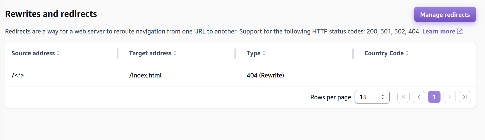
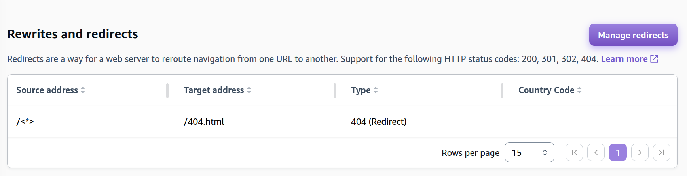

## Prerequisites
- an AWS Account
- a website generated with [11ty](https://www.11ty.dev/). This can likely be generalized to other static site generators as well. For sites built with raw HTML, I'd expect you could just update the configuration in the yaml file to exclude the `phases` portion. Adapt as necessary.
- a git repository pushed to Github, etc. Confirm compatible git repositories on AWS Amplify first.

## Configuring the Build

1. In your `package.json`, add the following line to the scripts section: `"build": "npx @11ty/eleventy"` . 
2. Add an `amplify.yml` file to the root of your repository with the following contents.

```yaml
version: 1
frontend:
	phases:
		preBuild:
			commands:
				- npm ci
		build:
			commands:
				- npm run build
	artifacts:
		baseDirectory: public
		files:
			- "**/*"
```

3. Commit the file to Github

## Push to Amplify [^1]
1. Navigate to [AWS Amplify](https://console.aws.amazon.com/amplify/apps) and choose `Create a New App`.
2. When prompted, select your git provider.
	1. For Github, it prompted me to allow AWS Amplify to read my repository data. I did not need to create a designated Github token.
3. Select your repo and branch.
4. Given you configured the build as above, you shouldn't need to update any build settings. Troubleshoot if something goes wrong.
5. Save and deploy.
6. Review your site to confirm that everything looks and works as you expected. I needed to configure the `404` redirect manually as below.
## Configuring the `404` Redirect

1. Go to `Hosting > Rewrites & Redirects` .
2. Click the `Manage redirects` button.
3. Edit the rule present to have target address of `/404.html` and change the type to `404 (Redirect)`. 

### Before



### After



See also:
- [Amplify Console User Guide](https://docs.aws.amazon.com/pdfs/amplify/latest/userguide/amplify-console-ug.pdf)

[^1]: “Host a Static Website on AWS.” _Amazon Web Services, Inc._, 16 July 2024, https://aws.amazon.com/getting-started/hands-on/host-static-website/.